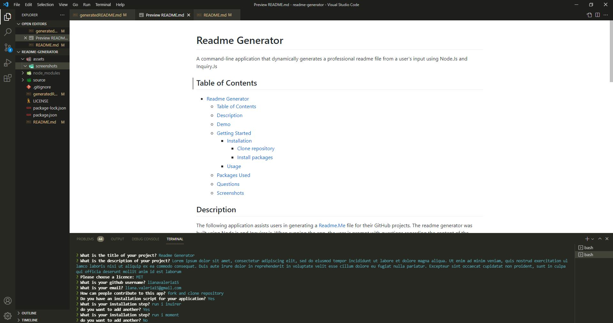

# Readme Generator

A command-line application that dynamically generates a professional readme file from a user's input using Node.Js and Inquiry.Js.

## Table of Contents

- [Readme Generator](#readme-generator)
  - [Table of Contents](#table-of-contents)
  - [Description](#description)
  - [Demo](#demo)
  - [Getting Started](#getting-started)
    - [Installation](#installation)
      - [Clone repository](#clone-repository)
      - [Install packages](#install-packages)
    - [Usage](#usage)
  - [Packages Used](#packages-used)
  - [Questions](#questions)
  - [Screenshots](#screenshots)
    - [Questions prompted on the terminal](#questions-prompted-on-the-terminal)

## Description

The following application assists users in generating a readme file for their GitHub projects. The readme generator was built using Node.js and Inquirer.js. The user is prompted with a series of questions regarding the readme file content (e.g. installation, usage or testing steps, contact details, how can people contribute to their project). After all answers are typed, a message is printed on the terminal to inform the user the file was generated.

## Demo

Click [here](https://drive.google.com/file/d/1ow9XaH1cUGkxuxBqRvq8QZTTT-uSGoPG/view?usp=sharing) to watch the demo.

## Getting Started

### Installation

To run the application, you will need to have [node.js](https://nodejs.org/en/) installed.

#### Clone repository

`git clone git@github.com:lianavaleria15/readme-generator.git`

#### Install packages

- use `npm init -y` to install package.json
- use `npm install inquirer` to install inquiry dependency

### Usage

- run `npm run start` in the terminal to be prompted with the questions

## Packages Used

## Questions

If you have any questions related to the application or repository, would like to collaborate or open an issue, please use the contact details below:

- 👩 [Liana Laurentiu](https://github.com/lianavaleria15)
- 📧 [liana.valeria15@gmail.com](mailto:liana.valeria15@gmail.com)

## Screenshots

### Questions prompted on the terminal

